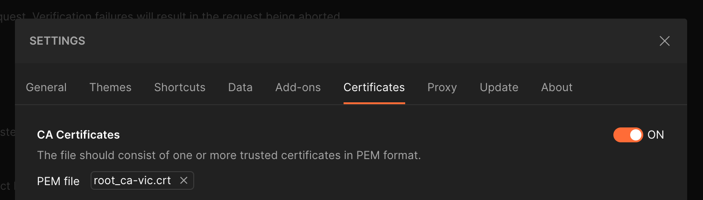

# Postman collection for step-ca

This is a very simple Postman collection that illustrates how to get a CSR signed by a step-ca server.

First, in Postman's general settings, under Certificates, add your CA Certificate PEM file:

Now import the step-ca Postman collection.

In the collection, go to the Variables tab, update the value of the  `caUrl` variable to match your CA endpoint, and save the collection.

Now run the "CA Health" request. You should get a "ok" response from the CA.

To get a CSR signed, you will need to fill in the values for `csr` and `ott` in the request for the `/1.0/sign` endpoint. The easiest way to generate those values is to use one of the other clients in this repository. Find more details in the Postman documentation for the signing endpoint.
